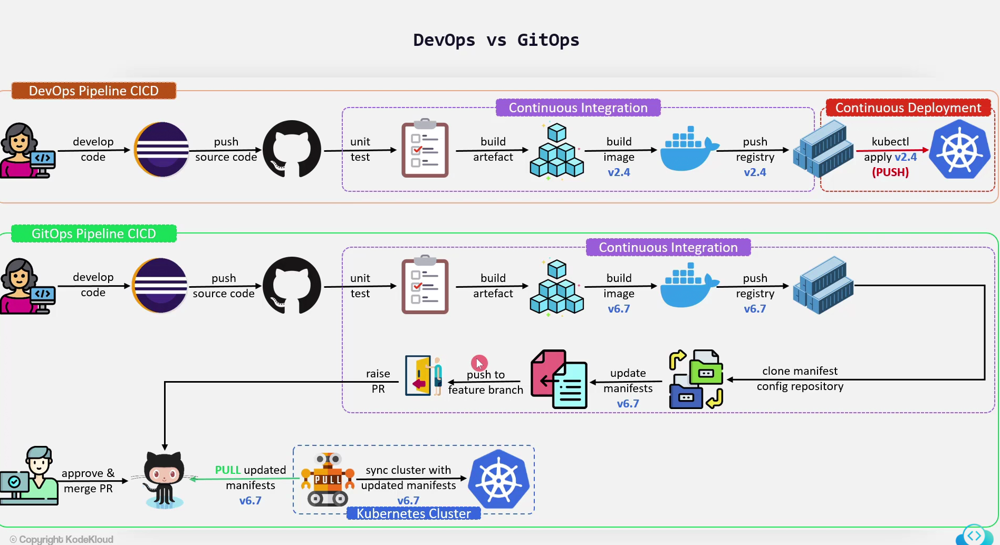

# ArgoCD-KK

## [GitOps](docs/gitops.md)

Principles:

* Declarative system
* Use Git
* GitOps Agent automatically pull the desired state from Git
* Self healthing:
  * Observe
  * Diff
  * act

## DevOps vs GitOps

