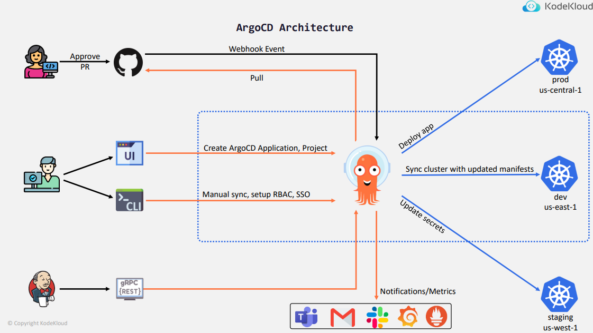
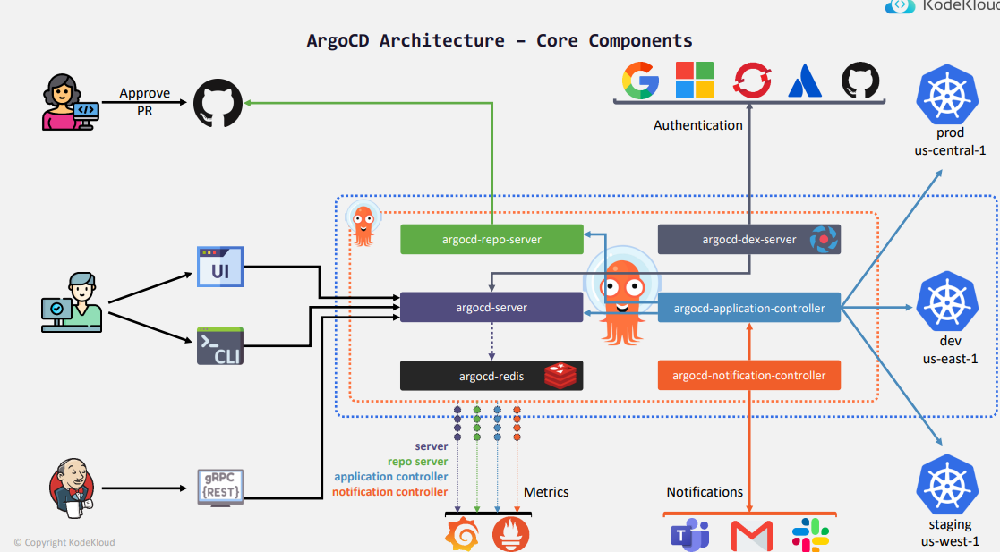

# ArgoCD

## Context

__What is it ?__
* Argo CD is a declarative, GitOps continuous delivery tool for Kubernetes resources defined in a Git repository 
* Continuously monitors running applications and comparing their live state to the desired state 
* It reports the deviations and provides visualizations to help developers manually or automatically sync the live state with the desired state.

__Why us ArgoCD ?__
* It extends the benefits of declarative specifications and Git-based configuration management
* It is the first step in achieving continuous operations based on monitoring, analytics, and automated remediation 
* It can deploy to multiple clusters and is Enterprise-friendly (auditability, compliance, security, RBAC, SSO and lot more)

__How ArgoCD works ?__
* It follows the GitOps pattern by using Git repositories as the source of truth for the desired state of app and the target deployment envs. 
* Kustomize applications, Helm charts, Ksonnet applications, Jsonnet files, YAML/JSON manifests
* It automates the synchronization of the desired application state with each of the specified target environments

## Concepts/Terminology

* Application: A group of Kubernetes resources as defined by a manifest
* Application source type: The tool is used to build the application. E.g. Helm, Kustomize or Ksonnet
* Project: Provide a logical grouping of applications, which is useful when Argo CD is used by multiple teams.
* Target state: The desired state of an application, as represented by files in a Git repository.
* Live state: The live state of that application. What pods, configmap, secrets, etc are created/deployed in a Kubernetes cluster.
* Sync status: Whether or not the live state matches the target state. Is the deployed application the same as Git says it should be?
* Sync: The process of making an application move to its target state. E.g. by applying changes to a Kubernetes cluster.
* Sync operation status: Whether or not a sync succeeded
* Refresh: Compare the latest code in Git with the live state. Figure out what is different.
* Health: The health of the application, is it running correctly? Can it serve requests?

## ArgoCD Features

* Automated deployment of applications to specified target
* environment in multiple clusters
* Support for multiple config management/templating tools
* (Kustomize, Helm, Ksonnet, Jsonnet, plain-YAML)
* SSO Integration (OIDC, OAuth2, LDAP, SAML 2.0, GitHub,
* GitLab, Microsoft, LinkedIn)
* Multi-tenancy and RBAC policies for authorization
* Rollback/Roll-anywhere to any application configuration committed in Git repository
* Health status analysis of application resources
* Automated configuration drift detection and visualization
* Out-of-the-box Prometheus metrics
* Audit trails for application events and API calls
* PreSync, Sync, PostSync hooks to support complex application
* rollouts (e.g.blue/green & canary upgrades)
* Automated or manual syncing of applications to its desired
* state
* Web UI which provides real-time view of application activity
* CLI and access tokens for automation and CI integration
* Webhook integration (GitHub, BitBucket, GitLab)

## Architecture



## Core component



## Installation

### Using manifest

* Requirement: create a dedicated namespace: `kuebctl create ns argocd`

```bash
kubectl apply -n argocd -f https://raw.githubusercontent.com/argoproj/argo-cd/stable/manifests/install.yaml
```

### Using helm

```bash
## Install chart
helm repo add argo https://argoproj.github.io/argo-helm

## Install repository
helm install my-argo-cd argo/argo-cd --version 4.8.0
```


## ArgoCD GUI

Once everythings is installed you can browse the ArgoCD GUI:

Expose your service:

1. Using `kubectl` command
    ```bash
    kubectl port-forward -n argocd services/argocd-server 8080:80
    ```

2. If you are using minikube:
    ```bash
    minikube service argocd-server --url --namespace argocd
    ```
## Get admin password

Get the admin password
```bash
kubectl -n argocd get secret argocd-initial-admin-secret -o jsonpath="{.data.password}" base64 -d
```

### CLI

#### Download and install binary

```bash
curl -sSL -o /usr/local/bin/argocd https://github.com/argoproj/argo-cd/releases/latest/download/argocd-linux-amd64

chmod +x /usr/local/bin/argocd
```

#### Configure

```bash
export ARGOCD_ADMIN_USER="admin"
export ARGOCD_ADMIN_PASSWORD=$(kubectl -n argocd get secret argocd-initial-admin-secret -o jsonpath="{.data.password}" | base64 -d)
export ARGOCD_SERVER_URL="127.0.0.1"
export ARGOCD_SERVER_PORT="8080"

argocd login --insecure --username ${ARGOCD_ADMIN_USER} --password ${ARGOCD_ADMIN_PASSWD} ${ARGOCD_SERVER_URL}:${ARGOCD_SERVER_PORT}
```

## ArgoCD Application

__Application__ is Customer Resource Definition which represents a deployed application instance in a cluster, in ArgoCD is defined by two key informations:
* __Source__: Mapped to a Git Repository containing the desired state of a kubernetes manifest
* __Destination__: The target where the k8s resources should be deployed

Application can be create through:
* ArgoCD CLI
* ArgoCD Web interface

## Application creation through CLI

1. Connect to a repo:
    ```bash
    argocd repo add https://github.com/FrenchyMike/gitops-argocd
    ```

2. Create an app:
    ```bash
    argocd app create solar-system-app-1 \
        --repo https://github.com/FrenchyMike/gitops-argocd \
        --path solar-system \
        --dest-namespace solar-system \
        --dest-server https://kubernetes.default.svc
    ```

3. Sync the app
    ```bash
    argocd app sync solar-system-app-1
    ```
    It should give you the following output:
    ```bash

    TIMESTAMP                  GROUP        KIND   NAMESPACE                    NAME    STATUS    HEALTH        HOOK  MESSAGE
    2024-08-29T13:33:08+02:00            Service  solar-system  solar-system-service  OutOfSync  Missing
    2024-08-29T13:33:08+02:00   apps  Deployment  solar-system          solar-system  OutOfSync  Missing
    2024-08-29T13:33:08+02:00            Service  solar-system  solar-system-service    Synced  Healthy
    2024-08-29T13:33:08+02:00            Service  solar-system  solar-system-service    Synced   Healthy              service/solar-system-service created
    2024-08-29T13:33:08+02:00   apps  Deployment  solar-system          solar-system  OutOfSync  Missing              deployment.apps/solar-system created
    2024-08-29T13:33:08+02:00   apps  Deployment  solar-system          solar-system    Synced  Progressing              deployment.apps/solar-system created

    Name:               argocd/solar-system-app-1
    Project:            default
    Server:             https://kubernetes.default.svc
    Namespace:          solar-system
    URL:                https://127.0.0.1:8080/applications/solar-system-app-1
    Source:
    - Repo:             https://github.com/FrenchyMike/gitops-argocd
    Target:
    Path:             solar-system
    SyncWindow:         Sync Allowed
    Sync Policy:        Manual
    Sync Status:        Synced to  (9368119)
    Health Status:      Progressing

    Operation:          Sync
    Sync Revision:      9368119178346ac95b73284c0233e2cb1abbf2e8
    Phase:              Succeeded
    Start:              2024-08-29 13:33:08 +0200 CEST
    Finished:           2024-08-29 13:33:08 +0200 CEST
    Duration:           0s
    Message:            successfully synced (all tasks run)

    GROUP  KIND        NAMESPACE     NAME                  STATUS  HEALTH       HOOK  MESSAGE
        Service     solar-system  solar-system-service  Synced  Healthy            service/solar-system-service created
    apps   Deployment  solar-system  solar-system          Synced  Progressing        deployment.apps/solar-system created
    ```

4. (Optional) Configure your app policy to automated:
    ```bash
    argocd app set solar-system-app-1 --sync-policy automated
    ```

### GitOps check

Let's make a modification of the solar-system docker image, commit and push and see if modification are took into account

1. Check current image:
    ```bash
    kubectl get pods -n solar-system -o jsonpath="{.items[*].spec.containers[*].image}" |  tr " " "\n"
    siddharth67/solar-system:v3
    siddharth67/solar-system:v3
    siddharth67/solar-system:v3
    ```

2. Edit docker image:
    ```bash
    sed -i 's/solar-system:v3/solar-system:v6/g' solar-system/deployment.yml
    ```

3. Commit and push
    ```bash
    git add solar-system/deployment.yml
    git commit -m "update solar system docker image"
    git push
    ```

4. If you're still in manual mode you have to make the sync:
    ```bash
    argocd aap sync solar-system-app-1
    ```
    Else you may have to wait up to 3 minutes for the automate sync
    
    Check the image again:
    ```bash
    kubectl get pods -n solar-system -o jsonpath="{.items[*].spec.containers[*].image}" |  sort | tr " " "\n"
    siddharth67/solar-system:v6
    siddharth67/solar-system:v6
    siddharth67/solar-system:v6
    ```
