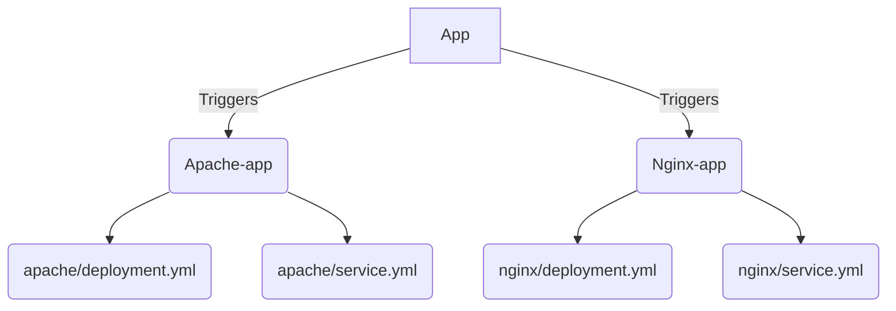

# ArgoCD Intermediate

## Reconcilation loop

__Reconcilation loop__ is how often ArgoCD will synchronize from the Git repository, by default it is set to __3 minutes__

This parameter can be configure within a config map:
```bash
$ kubectl -n argocd describe pod argocd-repo-server-8bfb86c4c-t4xc5 | grep -i "ARGOCD_RECONCILIATION_TIMEOUT:"
      ARGOCD_RECONCILIATION_TIMEOUT:                                <set to the key 'timeout.reconciliation' of config map 'argocd-cm'>                                          Optional: true
```

The `argocd-cm` is created empty by default when we deployed the argocd stack:
```bash
$ kubectl describe configmaps argocd-cm

Name:         argocd-cm
Namespace:    argocd
Labels:       app.kubernetes.io/name=argocd-cm
              app.kubernetes.io/part-of=argocd
Annotations:  <none>

Data
====

BinaryData
====

Events:  <none>
```

We can patch this configmap with the `timeout.reconciliation` key:

```bash
$ kubectl -n argocd patch configmaps argocd-cm --patch='{"data":{"timeout.reconciliation":"300s"}}'

configmap/argocd-cm patched
```

Then we restart the deployment:

```bash
$ kubectl -n argocd rollout restart deployment argocd-repo-server

deployment.apps/argocd-repo-server restarted
```

From the argoCD will check the git repository every 5 minutes

## Git Webhook configuration

We can create a webhook (from github interface for instance) in order to trigger synchronization on git event

https://argo-cd.readthedocs.io/en/stable/operator-manual/webhook/


## Application Heatlh Checks

### Status

* Healthy: All resources are 100% healthy
* Progressing: Resource is unhealthy, bu could still be healthy given time
* Degraded: Resource status indicates a failure or an inability to reach a healthy state
* Missing: Resources is not present in the cluster
* Suspended: Resource is suspended or paused. Typical example is a pause Deployment
* Unknow: Health assessment failed and actual health status is unknown

### Custom Health check

ArgoCD doc: https://argo-cd.readthedocs.io/en/stable/operator-manual/health/

```bash
$ kubectl -n argocd  edit cm argocd-cm

apiVersion: v1
data:
  timeout.reconciliation: 300s
  resource.customizations.health.ConfigMap: |
    hs = {}
    hs.status = "Healthy"
      if obj.data.TRIANGLE_COLOR == "white" then
        hs.status = "Degraded"
        hs.message = "Use a different COLOR for TRIANGLE"
      end
    return hs
```

## ArgoCD Sync Strategies

ArgoCD doc: https://argo-cd.readthedocs.io/en/stable/user-guide/auto_sync/

* Manual sync or Automatic sync
* Auto-pruning of resources
* Self-heal of cluster

Example:

1. Configure self heal using CLI
```bash
$ argocd app set argocd/health-check-app --sync-policy automated
$ argocd app set argocd/health-check-app --self-heal
```
_N.B: You can also cnfigure it through the web interface_

From now if you attempt to remove k8s resources using `kubectl` cli, argocd will restore them

You can do the same with auto-prune:
```bash
$ argocd app set <APPNAME> --auto-prune
```

This make resources auto-prune if they are removed from the git repository

## Declarative set up 

You can set your own app directly from a manifest

```yaml
apiVersion: argoproj.io/v1alpha1
kind: Application
metadata:
  name: geocentric-model-app
  namespace: argocd
  finalizers:
    - resources-finalizer.argocd.argoproj.io
spec:
  project: default

  source:
    repoURL: https://github.com/FrenchyMike/gitops-argocd.git
    targetRevision: HEAD
    path: ./declarative/manifests/geocentric-model
   
  destination:
    server: https://kubernetes.default.svc
    namespace: geocentric-model

  syncPolicy:
    syncOptions:
      - CreateNamespace=true  
    automated:
      prune: true
      selfHeal: true
```

## App of apps

### Purpose

Let's now try to make an app of apps, the idea is to have an app manifest which will trigger other app:



### Configure both nginx and apache manifests

To feed our example we simply two basic manifests: [deployment](https://kubernetes.io/docs/concepts/workloads/controllers/deployment/) and [service](https://kubernetes.io/fr/docs/concepts/services-networking/service/) for both nginx and apache.
* Apache:
  * [`deployment.yml`](../declarative/manifests/apache/deployment.yml)
  * [`service.yml`](../declarative/manifests/apache/service.yml)
* Nginx:
  * [`deployment.yml`](../declarative/manifests/nginx/deployment.yml)
  * [`service.yml`](../declarative/manifests/nginx/service.yml)

### Configure a dedicated app

* [Apache app](../declarative/apps/apache.yml)
* [Apache app](../declarative/apps/apache.yml)

