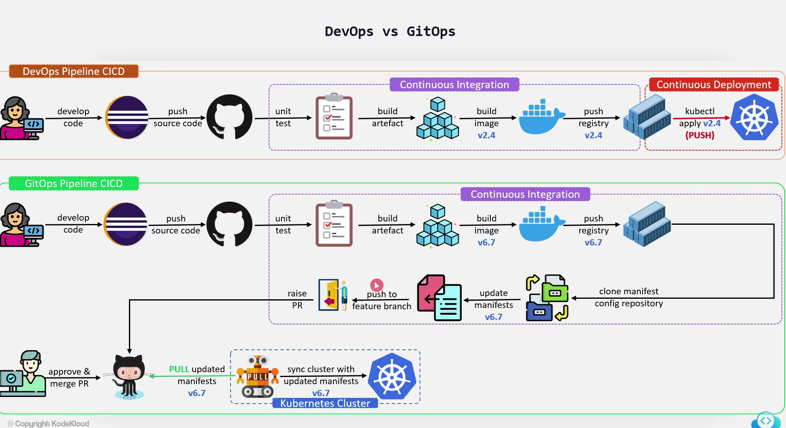

# GitOps

Principles:

* Declarative system
* Use Git
* GitOps Agent automatically pull the desired state from Git
* Self healthing:
  * Observe
  * Diff
  * act

## DevOps vs GitOps

## Push vs Pull based deployement

## GitOps feature set and usecases

* Single source of truth
* everything as a code
* Rollback application git repo
* Everything is auditable
* CI/CD Automation
* Continuous Deployment:
  * Application
  * Cluster Resources
  * Infrastructure
* Detecting, avoiding Configuration drift
* Multi cluster deployments

## GitOps Benefits and drawbacks

* Lighweight and vendor-neutral
* Faster, safer, immutable and reproductible deployments
* Eliminating configuration drift
* Uses familiar tools and processes