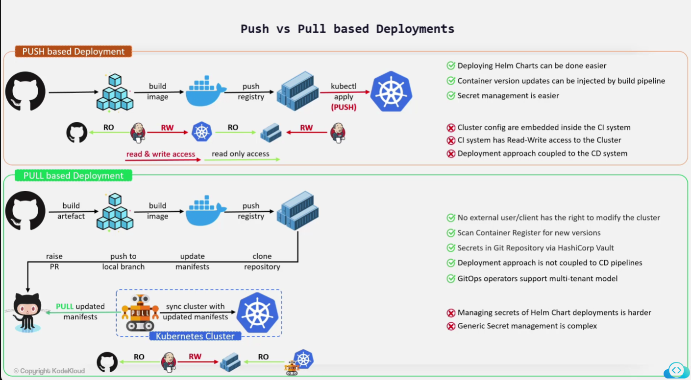

# GitOps

Principles:

* Declarative system
* Use Git
* GitOps Agent automatically pull the desired state from Git
* Self healthing:
  * Observe
  * Diff
  * act

## DevOps vs GitOps

## Push vs Pull based deployement

## GitOps feature set and usecases

* Single source of truth
* everything as a code
* Rollback application git repo
* Everything is auditable
* CI/CD Automation
* Continuous Deployment:
  * Application
  * Cluster Resources
  * Infrastructure
* Detecting, avoiding Configuration drift
* Multi cluster deployments

## GitOps Benefits and drawbacks

* Pros:
  * Lighweight and vendor-neutral
  * Faster, safer, immutable and reproductible deployments
  * Eliminating configuration drift
  * Uses familiar tools and processes
  * Revision wih history
* Cons
  * Doesn't help with secret management
  * Number of git repositories
  * Challenges with programmatic updates
  * Governance other than PR approval
  * Malformed YAML/Config manifests

## GitOps Projects tools

* ArgoCD
* FluxCD
* Atlantis
* Autoapply
* CloudBees Rollout
* JenkinsX
* Flagger
* Ignite
* Faros
* Helm operator
* Weave GitOps Core
* KubeStack
* Weave cloud
* GitKube
* PipeCD
* Werf